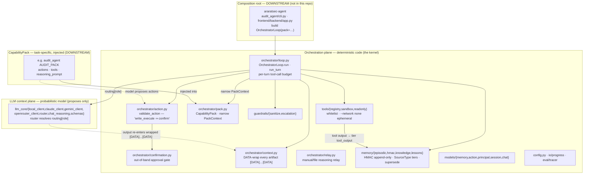

# Kernel architecture — the two-plane split

> 🇷🇺 Русская версия: [kernel-architecture.ru.md](kernel-architecture.ru.md)

What is actually wired in `sr_agent` today (kernel version 0.1.1). All security lives
in the **orchestration plane** (deterministic code); the model lives in the **LLM
context plane** and can only *propose*. The task-specific `CapabilityPack` and the
composition root that drives the loop both live **downstream** (in the
[araratsec-agent](https://github.com/RamilRamil/araratsec-agent) repo) — the kernel
imports zero pack code.

## Reading this

- **Two planes, one direction of authority.** Everything in the orchestration plane is
  ordinary deterministic code. The LLM context plane can *propose* an action or emit
  text; it never decides. A prompt- or memory-injection attack changes the proposal, not
  the permission — see [kernel.md](../kernel.md) for the invariants enforced here.
- **The OOB gate is kernel-derived.** `validate_action` requires out-of-band approval
  whenever `action.action_class == write_execute`. A pack supplies the `action_class`
  via its `ActionSpec` but has **no field** to mark such an action skip-confirmation, so
  it cannot lower the gate.
- **The pack boundary is real and tested.** No kernel module imports any pack module
  (`tests/architecture/test_kernel_pack_boundary.py`). The pack reaches the kernel only
  through the single `CapabilityPack` it assembles, and the kernel hands pack callables
  only a narrow `PackContext` — never the loop, never a memory-write handle. That is why
  a pack structurally cannot forge a `human_input`-tier record.
- **No composition root here.** The kernel ships no `cli.py` and no `[project.scripts]`;
  it is import-only. The `ROOTS` box is downstream in araratsec-agent. This diagram
  therefore shows the kernel as it is *consumed*, with the root/pack drawn as external.
- **Task-agnostic where it counts — not yet in every name.** The mechanisms are
  task-neutral and MI-proven against an in-repo fixture pack, but `PackContext` still
  names `audit_root`/`poc_dir`/`poc_generator` and `loop.py` still names `AuditResult`
  (pre-split residue, feature 048). No invariant depends on those names; see the "Honest
  scope" note in [kernel.md](../kernel.md).

## Related

- [kernel.md](../kernel.md) — the invariants and the CapabilityPack contract in prose.
- [turn-flow.md](turn-flow.md) — one `OrchestratorLoop.run_turn` step-by-step.
- [memory-trust-flow.md](memory-trust-flow.md) — the HMAC record lifecycle.
