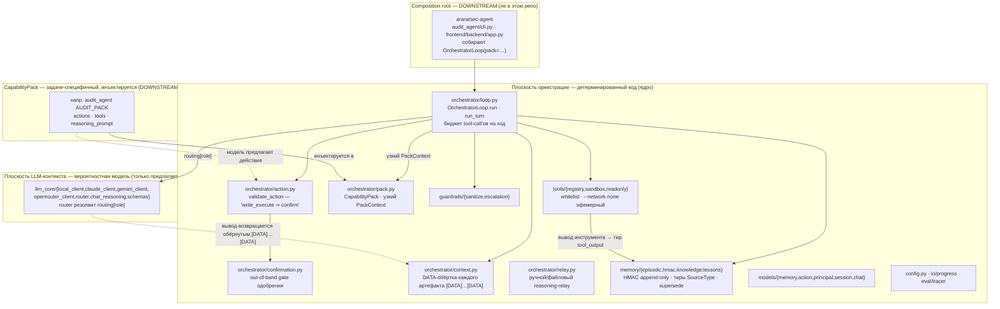

# Архитектура ядра — двухплоскостной раскол

> 🇬🇧 English version: [kernel-architecture.md](kernel-architecture.md)

Что реально подключено в `sr_agent` сегодня (ядро версии 0.1.1). Вся безопасность живёт
в **плоскости оркестрации** (детерминированный код); модель живёт в **плоскости
LLM-контекста** и может только *предлагать*. Задаче-специфичный `CapabilityPack` и
composition root, запускающий loop, живут **downstream** (в репозитории
[araratsec-agent](https://github.com/RamilRamil/araratsec-agent)) — ядро не импортирует
ни строчки кода паков.

## Как это читать

- **Две плоскости, одно направление власти.** Всё в плоскости оркестрации — обычный
  детерминированный код. Плоскость LLM-контекста может *предложить* действие или выдать
  текст; она никогда не решает. Атака prompt- или memory-injection меняет предложение, а
  не разрешение — инварианты, обеспечиваемые здесь, см. в [kernel.ru.md](../kernel.ru.md).
- **OOB-gate выводится ядром.** `validate_action` требует out-of-band одобрения всякий
  раз, когда `action.action_class == write_execute`. Пак задаёт `action_class` через свой
  `ActionSpec`, но у него **нет поля**, чтобы пометить такое действие как
  skip-confirmation, — понизить gate он не может.
- **Граница пака реальна и покрыта тестом.** Ни один модуль ядра не импортирует модули
  паков (`tests/architecture/test_kernel_pack_boundary.py`). Пак дотягивается до ядра
  только через единственный `CapabilityPack`, который собирает, а ядро отдаёт callable'ам
  пака только узкий `PackContext` — никогда loop, никогда handle на запись памяти. Именно
  поэтому пак структурно не может подделать запись тира `human_input`.
- **Здесь нет composition root.** Ядро не поставляет `cli.py` и `[project.scripts]`; оно
  только для импорта. Блок `ROOTS` — downstream в araratsec-agent. Поэтому диаграмма
  показывает ядро таким, каким его *потребляют*, с root/паком, нарисованными как внешние.
- **Task-agnostic там, где это важно, — но не в каждом имени.** Механизмы задаче-нейтральны
  и MI-доказаны против внутрирепозиторного fixture-пака, но `PackContext` всё ещё называет
  `audit_root`/`poc_dir`/`poc_generator`, а `loop.py` — `AuditResult` (остаток до-раскола,
  фича 048). Ни один инвариант от этих имён не зависит; см. раздел «Честный охват» в
  [kernel.ru.md](../kernel.ru.md).

## Связанное

- [kernel.ru.md](../kernel.ru.md) — инварианты и контракт CapabilityPack прозой.
- [turn-flow.ru.md](turn-flow.ru.md) — один `OrchestratorLoop.run_turn` пошагово.
- [memory-trust-flow.ru.md](memory-trust-flow.ru.md) — жизненный цикл HMAC-записи.
