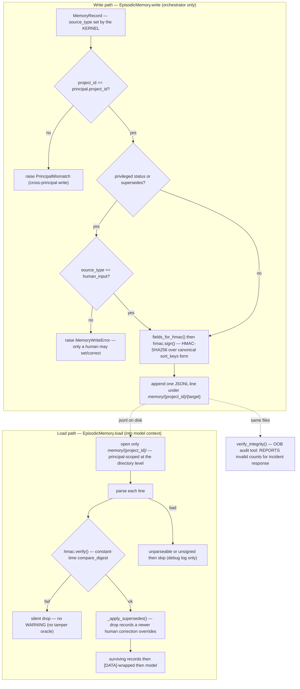

# Memory trust flow — the HMAC record lifecycle

> 🇷🇺 Русская версия: [memory-trust-flow.ru.md](memory-trust-flow.ru.md)

Every fact the agent remembers passes through `EpisodicMemory` (`sr_agent/memory/`). The
write path enforces policy before signing; the load path verifies before the model ever
sees a record. The store is **append-only** — corrections are new `supersede` records, and
only `human_input` may issue them.

## Reading this

- **The tier is set by the kernel, at write time.** `source_type` is a field the
  orchestrator fills (`human_input` > `tool_output` > `external_llm_output` /
  `human_relayed_tool` > `llm_inference`, per `TRUST_LEVELS`). No pack reaches this path, so
  model/relay output cannot claim a human tier.
- **The status gate is a hard write-time check.** A record that sets a status in
  `REQUIRES_HUMAN_CONFIRMATION` (e.g. `verified_safe`, `audit_complete`), or that carries a
  `supersedes`, is rejected unless `source_type == human_input` (`_enforce_status_rules`).
  This is what stops a model-tier record from flipping a verdict or overwriting a prior one.
- **Tamper fails closed and silently.** On load, a record whose HMAC does not verify is
  dropped with only a debug log — never WARNING+, so an attacker probing the store gets no
  signal about which forged record was rejected (no tamper oracle). `verify` uses
  `compare_digest`, so it is also constant-time against key-recovery.
- **Append-only, with `supersede` as the only correction.** There is no update or delete.
  `_apply_supersedes` removes any record whose `record_id` a later (human) record supersedes,
  so the model sees the corrected view without the history being mutable.
- **`verify_integrity` is the one place invalid records are *reported*.** It backs the
  out-of-band `sr-agent memory verify` audit — a human running incident response needs the
  count, and there is no tamper-oracle concern outside the model's load path.

## Related

- [mi-threat-model.md](../mi-threat-model.md) — the attacks these checks neutralise.
- [turn-flow.md](turn-flow.md) — where `_persist_finding` calls the write path.
