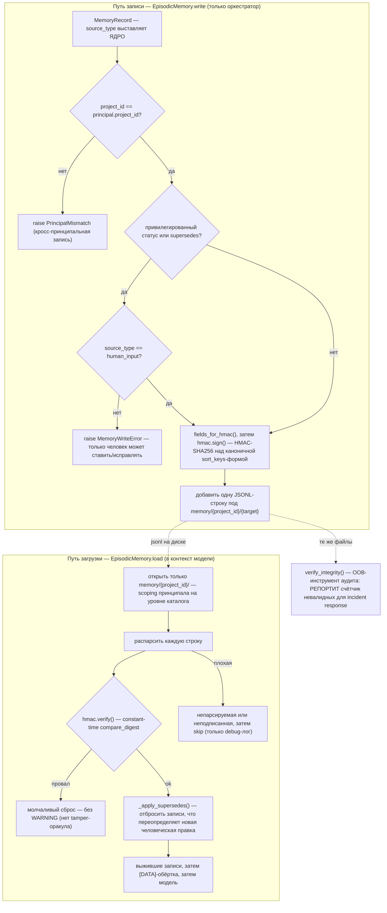

# Поток доверия памяти — жизненный цикл HMAC-записи

> 🇬🇧 English version: [memory-trust-flow.md](memory-trust-flow.md)

Каждый факт, который агент запоминает, проходит через `EpisodicMemory` (`sr_agent/memory/`).
Путь записи обеспечивает политику до подписи; путь загрузки проверяет до того, как модель
вообще увидит запись. Хранилище **append-only** — исправления это новые `supersede`-записи,
и только `human_input` может их выпускать.

## Как это читать

- **Тир выставляет ядро, на записи.** `source_type` — поле, которое заполняет оркестратор
  (`human_input` > `tool_output` > `external_llm_output` / `human_relayed_tool` >
  `llm_inference`, по `TRUST_LEVELS`). Ни один пак не дотягивается до этого пути, так что
  вывод модели/relay не может претендовать на человеческий тир.
- **Status-gate — жёсткая проверка на записи.** Запись, ставящая статус из
  `REQUIRES_HUMAN_CONFIRMATION` (напр. `verified_safe`, `audit_complete`), или несущая
  `supersedes`, отклоняется, если `source_type != human_input` (`_enforce_status_rules`).
  Именно это не даёт записи модельного тира перевернуть вердикт или переписать предыдущую.
- **Подмена fail closed и молча.** При загрузке запись, чей HMAC не проходит, отбрасывается
  лишь с debug-логом — никогда WARNING+, так что атакующий, щупающий хранилище, не получает
  сигнала о том, какая поддельная запись отклонена (нет tamper-оракула). `verify`
  использует `compare_digest`, поэтому это ещё и constant-time против восстановления ключа.
- **Append-only, с `supersede` как единственной правкой.** Нет update или delete.
  `_apply_supersedes` убирает любую запись, чей `record_id` переопределяет более поздняя
  (человеческая) запись, так что модель видит исправленный вид без мутабельности истории.
- **`verify_integrity` — единственное место, где невалидные записи *репортятся*.** Он стоит
  за out-of-band аудитом `sr-agent memory verify` — человеку в incident response нужен
  счётчик, и tamper-оракула вне пути загрузки модели тут нет.

## Связанное

- [mi-threat-model.ru.md](../mi-threat-model.ru.md) — атаки, которые нейтрализуют эти проверки.
- [turn-flow.ru.md](turn-flow.ru.md) — где `_persist_finding` вызывает путь записи.
