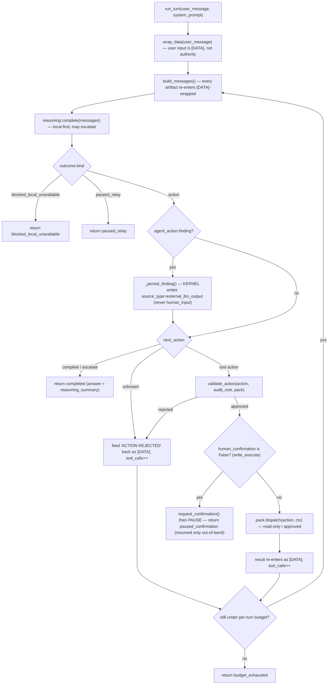

# Turn flow — one `OrchestratorLoop.run_turn`

> 🇷🇺 Русская версия: [turn-flow.ru.md](turn-flow.ru.md)

One chat turn (`sr_agent/orchestrator/loop.py::run_turn`). Local-first reasoning, read-only
tool calls bounded by a per-turn budget, and a hard pause on any `write_execute` action.
The user's own message enters model context **as `[DATA]`** — its wording carries no
authority (FR-004).

## Reading this

- **Everything the model touches is `[DATA]`.** The user message, every tool output, and
  the session-facts grounding all pass through `wrap_data` (`orchestrator/context.py`)
  before entering context. The model reads them as data; it never inherits their authority.
- **The model proposes; the kernel disposes.** `reasoning.complete` returns a proposed
  action. Nothing happens until `validate_action` approves it — and a rejected or unknown
  action is not a crash, it is fed back as `[DATA]` so the model can correct within the
  same turn.
- **`write_execute` always pauses.** When `validate_action` leaves `human_confirmation =
  False` (kernel-derived from `action_class`), the turn files an out-of-band confirmation
  and **returns** — it does not block-poll here. Execution happens later, only via
  `execute_confirmed`, and only after a human approves through a separate process (see
  [kernel.md](../kernel.md), `orchestrator/confirmation.py`). There is no shortcut around
  the gate.
- **A finding is written at kernel tier.** If the model reports a finding, the kernel — not
  the pack — persists it as `external_llm_output`; the pack only returns the domain object
  (see [capability-pack-interface.md](../capability-pack-interface.md)).
- **The turn is bounded.** Read-only dispatches loop until the per-turn tool-call budget is
  reached (`MAX_TOOL_CALLS_PER_TURN`), then the turn stops with `budget_exhausted`. The
  session spans many turns; a single turn cannot spin unbounded.

## Related

- [kernel-architecture.md](kernel-architecture.md) — where these modules sit.
- [memory-trust-flow.md](memory-trust-flow.md) — what `_persist_finding` and the load path do.
