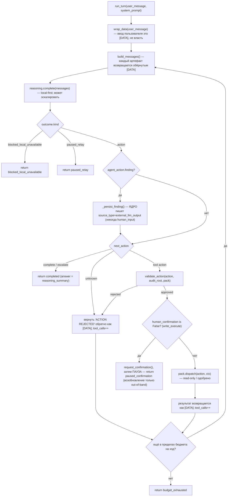

# Поток хода — один `OrchestratorLoop.run_turn`

> 🇬🇧 English version: [turn-flow.md](turn-flow.md)

Один чат-ход (`sr_agent/orchestrator/loop.py::run_turn`). Local-first рассуждение, read-only
вызовы инструментов, ограниченные бюджетом на ход, и жёсткая пауза на любом действии
`write_execute`. Собственное сообщение пользователя входит в контекст модели **как
`[DATA]`** — его формулировка не несёт власти (FR-004).

## Как это читать

- **Всё, чего касается модель, — это `[DATA]`.** Сообщение пользователя, каждый вывод
  инструмента и session-facts-grounding проходят через `wrap_data`
  (`orchestrator/context.py`) до входа в контекст. Модель читает их как данные; она никогда
  не наследует их власть.
- **Модель предлагает; ядро распоряжается.** `reasoning.complete` возвращает предложенное
  действие. Ничего не происходит, пока `validate_action` его не одобрит — а отклонённое или
  неизвестное действие это не крах, а возврат как `[DATA]`, чтобы модель поправилась в том
  же ходу.
- **`write_execute` всегда ставит на паузу.** Когда `validate_action` оставляет
  `human_confirmation = False` (выведено ядром из `action_class`), ход подаёт out-of-band
  подтверждение и **возвращается** — он не блокирует опросом здесь. Исполнение — позже,
  только через `execute_confirmed`, и только после того, как человек одобрит через отдельный
  процесс (см. [kernel.ru.md](../kernel.ru.md), `orchestrator/confirmation.py`). Обхода gate
  нет.
- **Находка пишется тиром ядра.** Если модель сообщает находку, её сохраняет ядро — не пак —
  как `external_llm_output`; пак лишь возвращает доменный объект (см.
  [capability-pack-interface.ru.md](../capability-pack-interface.ru.md)).
- **Ход ограничен.** Read-only-dispatch'и крутятся, пока не достигнут бюджет вызовов на ход
  (`MAX_TOOL_CALLS_PER_TURN`), затем ход останавливается с `budget_exhausted`. Сессия
  охватывает много ходов; один ход не может крутиться бесконечно.

## Связанное

- [kernel-architecture.ru.md](kernel-architecture.ru.md) — где сидят эти модули.
- [memory-trust-flow.ru.md](memory-trust-flow.ru.md) — что делают `_persist_finding` и путь загрузки.
